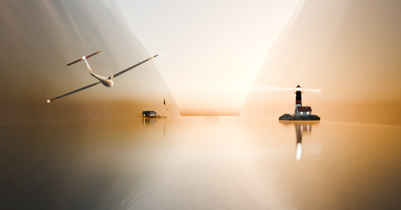

# Fenda Boreal



Jogo 3D no navegador feito com [three.js](https://threejs.org/): pilote um planador elétrico rente à água de um fiorde norueguês ao pôr do sol, passando por portões de corrida aérea e desviando de rochas e cabos de alta tensão. As construções das margens foram modeladas no [Blender](https://www.blender.org/).

## Como jogar

Online (publicado pelo GitHub Pages a cada push na `main`), em duas versões:

- **Original**: https://kt3746.github.io/Claude---para-Testes/
- **Com os marcos do fiorde** (farol, vila e igreja modelados no Blender): https://kt3746.github.io/Claude---para-Testes/marcos/

As duas ficam lado a lado no repositório: `index.html` é a original e `marcos/index.html` é a nova; a pasta `assets/` é compartilhada. O recorde e o fantasma também são compartilhados, porque ficam salvos no mesmo endereço.

Para rodar localmente:

Sirva a pasta por HTTP (a textura da água não carrega via `file://`) e abra no navegador. É preciso internet para carregar o three.js do CDN.

```bash
python3 -m http.server 8000
# depois abra http://localhost:8000 (original) ou http://localhost:8000/marcos/
```

| Ação | Controle |
| --- | --- |
| Pilotar | Mouse, WASD ou setas · arrastar o dedo em qualquer lugar no celular |
| Motor | Segurar Espaço, Shift ou botão do mouse · botão Motor no celular |
| Giro (tonneau) | Q / E ou botão direito do mouse · botão Giro no celular |
| Pausa | P ou Esc |
| Som | M |

### Pontuação

- **Cristais de aurora** aparecem em trilhas (reta, onda, arco e espiral), marcam passagens seguras e dão pontos e um pouco de bateria.
- **Portões**: passar entre os pilares laranja vale 100; pelo centro, 150 ("portão perfeito"). Recarrega a bateria.
- **Raspão**: passar a menos de 3 m de uma rocha, cabo ou pilar sem bater. Durante um giro vale mais que o dobro.
- **Giro**: 360° sobre o eixo do planador. De asas na vertical ele cabe em vãos estreitos.
- **Combo**: toda ação boa soma ao combo, que esfria em 3,5 s sem novas ações. O multiplicador vai até ×8. Bater zera o combo.
- **Missões** em sequência (cristais, raspões, portões seguidos, giros, combo, power-ups), cada vez mais difíceis, com recompensa em pontos e bateria cheia.

### Balsas

Balsas de duas proas cruzam o fiorde de um lado para o outro. Passe por cima (a ponte de comando tem cerca de 12 m), espere ela andar ou contorne. À noite as janelas acendem.

### Comportas de gelo

Na fase da noite surgem comportas de gelo: duas placas deslizam e abrem e fecham uma passagem a cada ~4 s. Passar vale 200 pontos (300 na fresta). Quase fechada, só cabe de asas na vertical, com o giro.

### Marcos do fiorde (só na versão `marcos/`)

A cada quilômetro, mais ou menos, surge uma construção numa das margens:

- **Farol** numa ilhota, com a casa do faroleiro. Do fim da tarde em diante o facho gira e dá um clarão quando aponta para você.
- **Vila de pescadores**: rorbuer vermelhas e ocre sobre palafitas, com cais, píer e barcos.
- **Stavkirke**, a igreja de madeira com telhados em camadas e cabeças de dragão, num patamar gramado que o relevo abre para ela.

As janelas acendem conforme escurece, e tudo se reflete na água. Os marcos são só cenário: ficam fora do corredor de voo e não entram na colisão.

### Fantasma do recorde

O jogo grava o seu voo. Quando você bate o recorde, esse voo vira um planador translúcido na próxima partida, e o HUD mostra quantos metros você está à frente ou atrás dele. Fica salvo no navegador.

### Power-ups

| Bolha | Efeito |
| --- | --- |
| Escudo (azul) | Aguenta uma batida |
| Ímã (vermelho) | Puxa os cristais próximos por 10 s |
| Fúria (amarelo) | 6 s mais rápido e invencível; pulveriza as rochas no caminho |
| Vida (rosa) | Uma vida a mais, até 5 |

### Fases do voo

O sol se põe enquanto você voa:

| Distância | Fase |
| --- | --- |
| 0 km | Pôr do sol |
| 2,5 km | Crepúsculo: hora azul, primeiras estrelas e luzes de navegação em destaque |
| 5 km | Noite da aurora: aurora boreal refletida na água; cristais valem o dobro |

Três vidas no início. Velocidade e densidade de obstáculos aumentam com a distância. O recorde fica salvo no navegador.

## Visual

- Céu físico (modelo de Preetham, `Sky`) com sol baixo; a luz ambiente e os reflexos vêm de um mapa de ambiente gerado a partir desse céu.
- Água com reflexo real da cena e mapa de normais animado (`Water`).
- Relevo do fiorde gerado por ruído em blocos que se renovam; rocha, musgo, neve e rocha molhada escolhidos no shader por altura e inclinação, com relevo fino por ruído 3D.
- Névoa de perspectiva aérea que usa a cor do céu na direção do olhar.
- Planador modelado com perfil de asa NACA, cauda em T, canopy de vidro e hélice elétrica no nariz.
- Sombras do sol, MSAA, bloom leve, tone mapping ACES e qualidade adaptativa para aparelhos mais fracos.
- Céu que escurece com a distância: o mapa de ambiente é refeito conforme o sol desce, a aurora (shader de cortinas com raios) e as estrelas aparecem e a água reflete tudo.
- Luzes de navegação do planador (vermelha à esquerda, verde à direita, branca na cauda) e flashes estroboscópicos.
- Bandos de gaivotas que se espalham quando o planador passa perto.
- Som sintetizado: vento que acompanha a velocidade, motor elétrico e bipes de cronometragem.

## Modelos 3D (Blender)

Os marcos saem de `tools/blender/cenario.py`, um script que monta tudo por código no Blender: geometria, materiais procedurais (tábuas, telhas de madeira, turfa, ferro com ferrugem, rocha com líquen) e a cena. O Cycles cozinha cor, oclusão de ambiente e janelas acesas numa textura por construção, e o resultado vai para `assets/cenario.glb` (glTF com malhas em Draco e texturas em WebP). No jogo, as janelas e o farol respondem à hora do dia, e as rochas usam o mesmo shader do relevo.

O cartaz (`assets/cartaz.jpg`) é renderizado no Cycles por `tools/blender/cartaz.py`. Ele usa o relevo do jogo (o mesmo ruído, com a mesma semente, portado para Python), um céu físico (Nishita) e o planador reconstruído a partir do código three.js.

Para gerar de novo, com o Blender 4.2 ou mais novo, ou com o módulo `bpy` do PyPI (Python 3.11):

```bash
pip install "bpy==4.5.*"
python3 tools/blender/cenario.py            # só o assets/cenario.glb (~1 min)
python3 tools/blender/cenario.py --cartaz   # também o cartaz (bem mais demorado)
# ou: blender -b -P tools/blender/cenario.py -- --cartaz
```

## Créditos

- `assets/waternormals.jpg`: do repositório do [three.js](https://github.com/mrdoob/three.js) (licença MIT).
